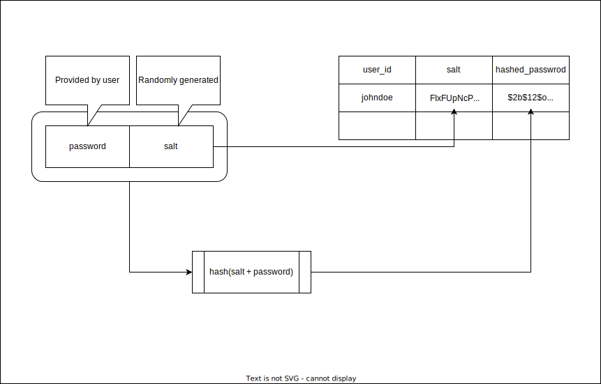
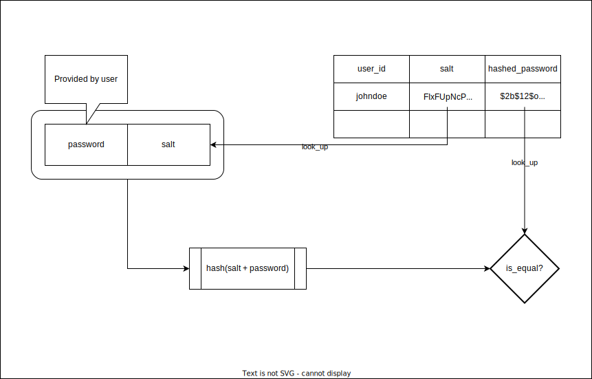

# User Authentication

This is a template for simple user authentication with FastAPI. It handles the following tasks:
* storage of user credentials
* user credential authentication
* token generation
* token authentication

## Password Storage and Validation 

### Storage
To allow for safe storage of user credentials the password hash is computed using a concatenation of a random string and the user provided password. The salt (the random string) and the hashed password are stored together. 

### Validation
To validate a provided password, the salt and the hashed password are retrieved. Then the hashed password is recomputed using the provided password and the retrieved salt. If the produced hash is equal to the retrieved hashed password, then the provided password is valid.

## Sources

* https://fastapi.tiangolo.com/tutorial/security/oauth2-jwt/
* https://www.youtube.com/watch?v=zt8Cocdy15c